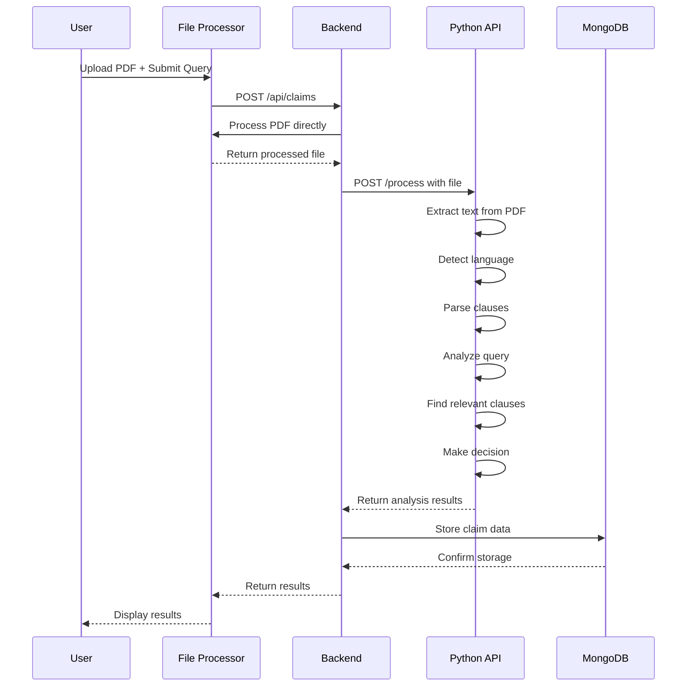
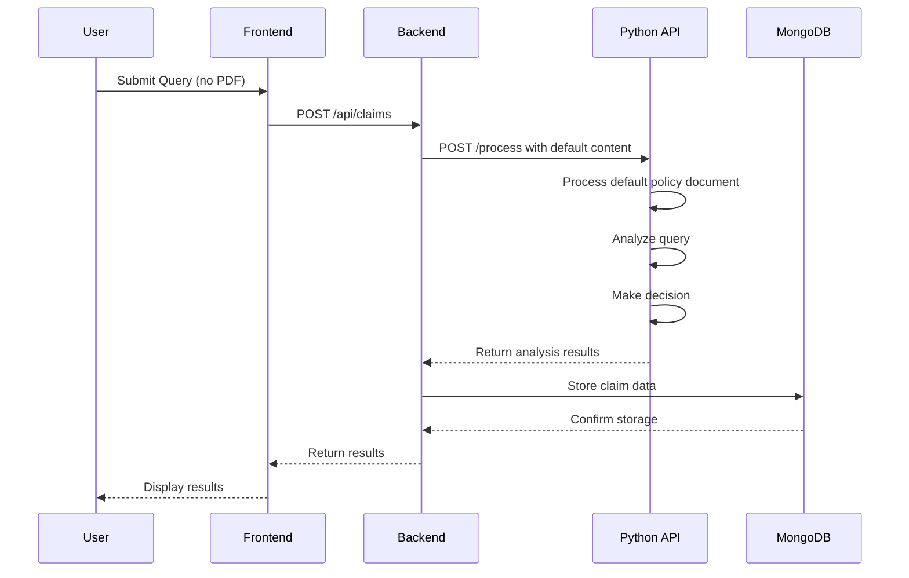

# 📡 BajajBot API Documentation

## 🔗 Base URLs

- **Frontend**: `http://localhost:5000`
- **Backend API**: `http://localhost:5000/api`
- **Python AI API**: `http://localhost:8000`

## 🏗️ System Architecture

```
┌─────────────────────────────────────────────────────────────────────────────┐
│                              USER INTERFACE                                 │
├─────────────────────────────────────────────────────────────────────────────┤
│  ┌─────────────────┐    ┌─────────────────┐    ┌─────────────────────────┐  │
│  │   React App     │    │   File Upload   │    │    Results Display      │  │
│  │   (Frontend)    │    │   Component     │    │      Component          │  │
│  └─────────────────┘    └─────────────────┘    └─────────────────────────┘  │
└─────────────────────────────────────────────────────────────────────────────┘
                                    │
                                    ▼
┌─────────────────────────────────────────────────────────────────────────────┐
│                            NODE.JS BACKEND                                 │
├─────────────────────────────────────────────────────────────────────────────┤
│  ┌─────────────────┐    ┌─────────────────┐    ┌─────────────────────────┐  │
│  │   Express.js    │    │   Multer        │    │    Axios HTTP Client    │  │
│  │   Server        │    │   File Handler  │    │    (Python API Call)    │  │
│  └─────────────────┘    └─────────────────┘    └─────────────────────────┘  │
│  ┌─────────────────┐    ┌─────────────────┐    ┌─────────────────────────┐  │
│   File Processing  │    │   MongoDB       │    │    FormData Builder     │  │
│   (Direct)         │    │   Storage       │    │    (File Processing)    │  │
│  └─────────────────┘    └─────────────────┘    └─────────────────────────┘  │
└─────────────────────────────────────────────────────────────────────────────┘
                                    │
                                    ▼
┌─────────────────────────────────────────────────────────────────────────────┐
│                            PYTHON AI/ML API                                │
├─────────────────────────────────────────────────────────────────────────────┤
│  ┌─────────────────┐    ┌─────────────────┐    ┌─────────────────────────┐  │
│  │   FastAPI       │    │   PyMuPDF       │    │    FastText Language    │  │
│  │   Server        │    │   PDF Parser    │    │    Detection            │  │
│  └─────────────────┘    └─────────────────┘    └─────────────────────────┘  │
│  ┌─────────────────┐    ┌─────────────────┐    ┌─────────────────────────┐  │
│  │   Sentence      │    │   M2M100        │    │    NLTK Text            │  │
│  │   Transformers  │    │   Translation   │    │    Processing           │  │
│  └─────────────────┘    └─────────────────┘    └─────────────────────────┘  │
│  ┌─────────────────┐    ┌─────────────────┐    ┌─────────────────────────┐  │
│  │   Semantic      │    │   Claim         │    │    Decision             │  │
│  │   Search        │    │   Evaluation    │    │    Engine               │  │
│  └─────────────────┘    └─────────────────┘    └─────────────────────────┘  │
└─────────────────────────────────────────────────────────────────────────────┘
                                    │
                                    ▼
┌─────────────────────────────────────────────────────────────────────────────┐
│                              DATA STORAGE                                  │
├─────────────────────────────────────────────────────────────────────────────┤
│  ┌─────────────────┐    ┌─────────────────┐    ┌─────────────────────────┐  │
│   MongoDB       │    │   Local File      │    │    Temporary Files      │  │
│   Atlas         │    │   Processing      │    │    (Local Processing)   │  │
│   (Claim Data)  │    │   (Direct)        │    │                         │  │
│  └─────────────────┘    └─────────────────┘    └─────────────────────────┘  │
└─────────────────────────────────────────────────────────────────────────────┘

📊 DATA FLOW:
User Upload → Frontend Validation → Backend Processing → Direct File Processing → 
Python AI Analysis → MongoDB Storage → Results Display
```

## 📋 Backend API Routes (Node.js)

### 1. POST `/api/claims`
Process insurance claim query with optional PDF upload.

**Endpoint**: `POST http://localhost:5000/api/claims`

**Content-Type**: `multipart/form-data`

**Request Body**:
```javascript
FormData:
- query: string (required) - Insurance claim query
- pdf: file (optional) - PDF policy document
```

**Example Request**:
```javascript
const formData = new FormData();
formData.append('query', '46-year-old male, knee surgery in Pune, 3-month-old insurance policy');
formData.append('pdf', pdfFile); // Optional

fetch('/api/claims', {
  method: 'POST',
  body: formData
});
```

**Success Response** (200):
```json
{
  "id": "abc123def456",
  "QueryDetails": {
    "age": "46",
    "gender": "Male",
    "procedure": "knee surgery",
    "location": "Pune",
    "policy_duration": "3"
  },
  "Decision": "Approved",
  "Amount": 500000,
  "Justification": "Clause: 'Inpatient hospitalization is covered' - knee surgery covered under inpatient hospitalization for a 3-month policy.",
  "RelevantClauses": [
    {
      "text": "Inpatient hospitalization is covered up to the sum insured",
      "source": "policy_document.pdf",
      "position": 0
    }
  ]
}
```

**Error Responses**:
```json
// 400 - Bad Request
{
  "message": "Query is required"
}

// 500 - Internal Server Error
{
  "message": "Failed to upload file"
}
```

### 2. GET `/api/claims/:id`
Retrieve specific claim by ID.

**Endpoint**: `GET http://localhost:5000/api/claims/:id`

**Example Request**:
```javascript
fetch('/api/claims/abc123def456')
  .then(response => response.json())
  .then(data => console.log(data));
```

**Success Response** (200):
```json
{
  "id": "abc123def456",
  "query": "46-year-old male, knee surgery in Pune, 3-month-old insurance policy",
  "pdfFileName": "policy_document.pdf",
  "response": {
    "QueryDetails": {...},
    "Decision": "Approved",
    "Amount": 500000,
    "Justification": "...",
    "RelevantClauses": [...]
  },
  "createdAt": "2024-01-15T10:30:00.000Z"
}
```

**Error Response** (404):
```json
{
  "message": "Claim query not found"
}
```

### 3. GET `/api/claims`
Get all claim queries.

**Endpoint**: `GET http://localhost:5000/api/claims`

**Example Request**:
```javascript
fetch('/api/claims')
  .then(response => response.json())
  .then(data => console.log(data));
```

**Success Response** (200):
```json
[
  {
    "id": "abc123def456",
    "query": "46-year-old male, knee surgery in Pune, 3-month-old insurance policy",
    "pdfFileName": "policy_document.pdf",
    "cloudinaryUrl": "https://res.cloudinary.com/.../policy_document.pdf",
    "response": {...},
    "createdAt": "2024-01-15T10:30:00.000Z"
  },
  {
    "id": "def456ghi789",
    "query": "32-year-old female, maternity care in Mumbai, 2-year-old policy",
    "pdfFileName": "maternity_policy.pdf",
    "response": {...},
    "createdAt": "2024-01-15T09:15:00.000Z"
  }
]
```

## 🤖 Python AI API Routes

### 1. POST `/process`
Process query and document for claim analysis.

**Endpoint**: `POST http://localhost:8000/process`

**Content-Type**: `multipart/form-data`

**Request Body**:
```javascript
FormData:
- query: string (required) - Insurance claim query
- file: file (required) - Document file (PDF, TXT, DOCX, EML)
```

**Example Request**:
```javascript
const formData = new FormData();
formData.append('query', '46-year-old male, knee surgery in Pune, 3-month-old insurance policy');
formData.append('file', fileBuffer, {
  filename: 'policy_document.pdf',
  contentType: 'application/pdf'
});

fetch('http://localhost:8000/process', {
  method: 'POST',
  body: formData
});
```

**Success Response** (200):
```json
{
  "QueryDetails": {
    "age": "46",
    "gender": "Male",
    "procedure": "knee surgery",
    "location": "Pune",
    "policy_duration": "3"
  },
  "Decision": "Approved",
  "Amount": 500000,
  "Justification": "Clause: 'Inpatient hospitalization is covered' - knee surgery covered under inpatient hospitalization for a 3-month policy.",
  "RelevantClauses": [
    {
      "text": "Inpatient hospitalization is covered up to the sum insured",
      "source": "policy_document.pdf",
      "position": 0
    },
    {
      "text": "Pre and post hospitalization expenses are covered",
      "source": "policy_document.pdf",
      "position": 1
    }
  ]
}
```

**Error Response** (500):
```json
{
  "error": "No content extracted from document"
}
```

## 🔄 Data Flow Examples

### Example 1: Complete Claim Processing



### Example 2: Query Without PDF



## 📊 Response Data Structures

### QueryDetails Object
```typescript
interface QueryDetails {
  age: string | null;           // Extracted age
  gender: string | null;        // "Male" or "Female"
  procedure: string | null;     // Medical procedure
  location: string | null;      // Geographic location
  policy_duration: string | null; // Policy duration in months
}
```

### RelevantClauses Array
```typescript
interface RelevantClause {
  text: string;     // Clause text content
  source: string;   // Source document filename
  position: number; // Position in document
}
```

### Decision Object
```typescript
interface Decision {
  Decision: "Approved" | "Rejected";
  Amount: number | null;        // Claim amount in INR
  Justification: string;        // Decision explanation
}
```

## 🎯 AI Analysis Process

### 1. Document Processing
```python
# Extract text from various formats
def extract_text(file_path, doc_lang='eng'):
    if ext == '.pdf':
        return extract_text_from_pdf(file_path, doc_lang)
    elif ext == '.docx':
        return extract_text_from_docx(file_path)
    elif ext == '.txt':
        return read_text_file(file_path)
```

### 2. Language Detection
```python
# Detect document language
def detect_language(text):
    predictions = lang_detector.predict(text, k=1)
    lang = predictions[0][0].replace('_label_', '')
    return lang if lang in supported_languages else 'en'
```

### 3. Clause Extraction
```python
# Parse document into clauses
def parse_document(file_path, doc_lang='eng'):
    text = clean_text(extract_text(file_path, doc_lang))
    sections = section_splitter.split(text)
    clauses = extract_clauses_from_sections(sections)
    return clauses
```

### 4. Query Analysis
```python
# Extract claim details from query
def parse_query(query, query_lang):
    patterns = {
        "age": r'(\d{1,3})',
        "gender": r'[MmFf]|male|female',
        "procedure": r'([a-zA-Z\s]+(?:surgery|procedure|care))',
        "location": r'([A-Z][a-zA-Z]+(?:\s[A-Z][a-zA-Z]+))',
        "policy_duration": r'(\d{1,2})-month'
    }
    return extract_entities(query, patterns)
```

### 5. Semantic Search
```python
# Find relevant clauses using embeddings
def search_clauses(query, clauses, file_path):
    query_embedding = embedder.encode(query)
    clause_embeddings = get_clause_embeddings(clauses)
    similarities = util.cos_sim(query_embedding, clause_embeddings)
    return get_top_clauses(similarities, clauses)
```

### 6. Decision Making
```python
# Evaluate claim based on policy rules
def evaluate_decision(query_details, relevant_clauses, query):
    for clause, _ in relevant_clauses:
        if check_waiting_period(clause, query_details):
            return create_rejection_decision(clause, "waiting period")
        if check_coverage(clause, query_details):
            return create_approval_decision(clause, query_details)
    return create_default_rejection()
```

## 🔧 Error Handling

### Common Error Codes

| Code | Description | Solution |
|------|-------------|----------|
| 400 | Bad Request | Check request format and required fields |
| 404 | Not Found | Verify resource ID exists |
| 413 | Payload Too Large | Reduce file size (max 10MB) |
| 415 | Unsupported Media Type | Use PDF format only |
| 500 | Internal Server Error | Check server logs and dependencies |

### Error Response Format
```json
{
  "error": "Error description",
  "code": "ERROR_CODE",
  "timestamp": "2024-01-15T10:30:00.000Z"
}
```

## 🚀 Performance Tips

1. **File Size**: Keep PDFs under 10MB for faster processing
2. **Image Quality**: Use text-based PDFs instead of scanned images
3. **Query Length**: Keep queries concise but informative
4. **Caching**: Results are cached for repeated queries
5. **Batch Processing**: Multiple texts processed together for efficiency

## 🔒 Security Considerations

1. **File Validation**: Only PDF files accepted
2. **Size Limits**: 10MB maximum file size
3. **Input Sanitization**: Query text sanitized before processing
4. **Local Processing**: Files processed directly without cloud storage
5. **Database Security**: MongoDB Atlas with authentication

---

**For more information, see the main README.md file.**
