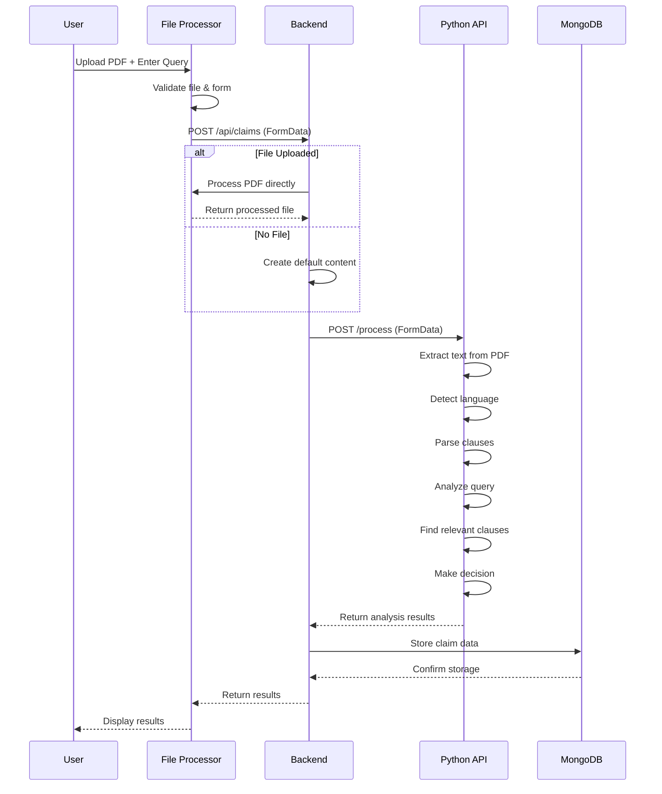

# 🔄 BajajBot Workflow Documentation

## 📋 Complete System Workflow

### 🎯 User Journey Flow

```
┌─────────────────────────────────────────────────────────────────────────────┐
│                              USER INTERFACE                                 │
├─────────────────────────────────────────────────────────────────────────────┤
│                                                                             │
│  1. User opens website (http://localhost:5000)                            │
│  2. User uploads insurance policy PDF                                      │
│  3. User enters claim query                                                │
│  4. User clicks "Process Claim" button                                     │
│                                                                             │
└─────────────────────────────────────────────────────────────────────────────┘
                                    │
                                    ▼
┌─────────────────────────────────────────────────────────────────────────────┐
│                            FRONTEND VALIDATION                             │
├─────────────────────────────────────────────────────────────────────────────┤
│                                                                             │
│  ✓ File size check (max 10MB)                                              │
│  ✓ File type validation (PDF only)                                         │
│  ✓ Query text validation                                                   │
│  ✓ Form data preparation                                                   │
│                                                                             │
└─────────────────────────────────────────────────────────────────────────────┘
                                    │
                                    ▼
┌─────────────────────────────────────────────────────────────────────────────┐
│                            BACKEND PROCESSING                              │
├─────────────────────────────────────────────────────────────────────────────┤
│                                                                             │
│  1. Multer receives file upload                                            │
│  2. Direct file processing (if file provided)                             │
│  3. MongoDB connection established                                         │
│  4. FormData preparation for Python API                                    │
│  5. HTTP request to Python AI API                                          │
│                                                                             │
└─────────────────────────────────────────────────────────────────────────────┘
                                    │
                                    ▼
┌─────────────────────────────────────────────────────────────────────────────┐
│                            PYTHON AI PROCESSING                            │
├─────────────────────────────────────────────────────────────────────────────┤
│                                                                             │
│  1. FastAPI receives request                                               │
│  2. File extraction and text parsing                                       │
│  3. Language detection (FastText)                                          │
│  4. Document clause extraction                                             │
│  5. Query analysis and entity extraction                                   │
│  6. Semantic search for relevant clauses                                   │
│  7. Claim evaluation and decision making                                   │
│  8. Response formatting and translation                                    │
│                                                                             │
└─────────────────────────────────────────────────────────────────────────────┘
                                    │
                                    ▼
┌─────────────────────────────────────────────────────────────────────────────┐
│                            DATA STORAGE                                    │
├─────────────────────────────────────────────────────────────────────────────┤
│                                                                             │
│  1. MongoDB: Store claim query and results                                 │
│  2. Local processing: Direct file handling                                  │
│  3. Temporary files cleanup                                                │
│                                                                             │
└─────────────────────────────────────────────────────────────────────────────┘
                                    │
                                    ▼
┌─────────────────────────────────────────────────────────────────────────────┐
│                            RESULTS DISPLAY                                 │
├─────────────────────────────────────────────────────────────────────────────┤
│                                                                             │
│  1. Frontend receives response                                             │
│  2. Results component renders                                              │
│  3. User sees:                                                             │
│     • Claim decision (Approved/Rejected)                                   │
│     • Claim amount                                                         │
│     • Justification                                                        │
│     • Relevant policy clauses                                              │
│                                                                             │
└─────────────────────────────────────────────────────────────────────────────┘
```

## 🔧 Detailed Technical Workflow

### 1. Frontend Processing

```typescript
// 1. File Upload Validation
const handleFileUpload = (file: File) => {
  if (file.size > 10 * 1024 * 1024) {
    alert("File size must be less than 10MB");
    return;
  }
  if (file.type !== "application/pdf") {
    alert("Only PDF files are allowed");
    return;
  }
  setSelectedFile(file);
};

// 2. Form Submission
const handleSubmit = async (e: FormEvent) => {
  e.preventDefault();
  
  const formData = new FormData();
  formData.append('query', query);
  if (selectedFile) {
    formData.append('pdf', selectedFile);
  }
  
  // Send to backend
  const response = await fetch('/api/claims', {
    method: 'POST',
    body: formData
  });
};
```

### 2. Backend Processing

```typescript
// 1. File Upload Handling
app.post("/api/claims", upload.single('pdf'), async (req, res) => {
  const { query } = req.body;
  
  // 2. Direct File Processing
  let pdfFileName = null;
  if (req.file) {
    pdfFileName = req.file.originalname;
  }
  
  // 3. Python API Call
  const form = new FormData();
  form.append('query', query);
  
  if (req.file) {
    form.append('file', req.file.buffer, {
      filename: req.file.originalname,
      contentType: 'application/pdf'
    });
  }
  
  const response = await axios.post('http://localhost:8000/process', form);
  
  // 4. Database Storage
  const claimQuery = await storage.createClaimQuery({
    query,
    pdfFileName: req.file?.originalname,
    response: response.data,
  });
  
  res.json(claimQuery);
});
```

### 3. Python AI Processing

```python
# 1. Request Processing
@app.post("/process")
async def process(query: str = Form(...), file: UploadFile = File(...)):
    file_location = f"temp_{file.filename}"
    
    # 2. File Handling
    with open(file_location, "wb") as f:
        content = await file.read()
        f.write(content)
    
    # 3. Document Processing
    result = process_query(query, file_location)
    
    # 4. Cleanup
    if os.path.exists(file_location):
        os.remove(file_location)
    
    return JSONResponse(content=result)

# 5. AI Analysis Pipeline
def process_query(query, document_path):
    # Language detection
    doc_lang = detect_language(extract_text(document_path))
    query_lang = detect_language(query)
    
    # Document parsing
    clauses = parse_document(document_path, doc_lang)
    
    # Query analysis
    query_details = parse_query(query, query_lang)
    
    # Semantic search
    relevant_clauses = search_clauses(query, clauses, document_path)
    
    # Decision making
    decision = evaluate_decision(query_details, relevant_clauses, query)
    
    return {
        "QueryDetails": query_details,
        "Decision": decision["Decision"],
        "Amount": decision["Amount"],
        "Justification": decision["Justification"],
        "RelevantClauses": relevant_clauses
    }
```

## 📊 Data Flow Diagram



## 🎯 Key Processing Steps

### 1. Document Processing
- **File Validation**: Size, type, format checks
- **Text Extraction**: PyMuPDF for PDF parsing
- **Language Detection**: FastText for automatic language identification
- **Clause Extraction**: NLTK for text segmentation

### 2. Query Analysis
- **Entity Extraction**: Age, gender, procedure, location, policy duration
- **Language Processing**: Query language detection and translation
- **Pattern Matching**: Regex patterns for claim details

### 3. AI Analysis
- **Semantic Search**: Sentence transformers for clause relevance
- **Embedding Generation**: Text embeddings for similarity matching
- **Decision Logic**: Rule-based claim evaluation

### 4. Data Management
- **Local Processing**: Direct file processing without cloud storage
- **Database Storage**: MongoDB for claim queries
- **Temporary Files**: Local processing with cleanup

## 🔍 Error Handling Workflow

```
Error Detection → Error Classification → Error Response → User Notification
```

### Common Error Scenarios:

1. **File Upload Errors**
   - File too large → Size limit message
   - Invalid file type → Format error message
   - Upload failure → Retry option

2. **Processing Errors**
   - Python API down → Service unavailable message
   - Document parsing failed → Invalid document message
   - AI model error → Processing error message

3. **Database Errors**
   - Connection failed → Storage error message
   - Query failed → Data retrieval error

## 📈 Performance Optimization

### 1. Frontend Optimizations
- **React.memo**: Prevent unnecessary re-renders
- **useCallback**: Memoize event handlers
- **Conditional logging**: Development-only console logs

### 2. Backend Optimizations
- **Memory storage**: Multer memory storage for faster processing
- **Streaming uploads**: Direct buffer handling
- **Connection pooling**: MongoDB connection reuse

### 3. AI Processing Optimizations
- **Caching**: Translation and embedding results
- **Batch processing**: Multiple texts processed together
- **Memory management**: Temporary file cleanup

## 🔒 Security Workflow

### 1. Input Validation
- **File validation**: Type, size, content checks
- **Query sanitization**: XSS prevention
- **Rate limiting**: Request throttling

### 2. Data Protection
- **Local processing**: Direct file processing without cloud storage
- **Database security**: MongoDB Atlas with authentication
- **Environment variables**: Sensitive data protection

### 3. Access Control
- **File access**: Temporary file permissions
- **API access**: CORS configuration
- **Error handling**: No sensitive data exposure

---

**This workflow ensures reliable, secure, and efficient insurance claim processing! 🏥✨**
